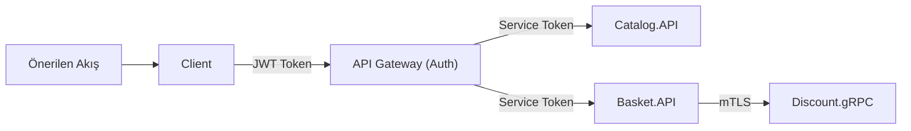

# 🔐 EShop Microservices — Güvenlik & Performans Danışma Raporu

> **Rapor Tarihi:** 2026-06-05  
> **Kapsam:** `eshop-microservices.sln` — Tüm Projeler  
> **Analiz Türü:** Statik Kod Analizi + Mimari İnceleme

---

## 📊 Yönetici Özeti

| Kategori | Kritik | Yüksek | Orta | Düşük | Toplam |
|----------|--------|--------|------|-------|--------|
| 🔴 Güvenlik | 5 | 7 | 5 | 3 | **20** |
| ⚡ Performans | 2 | 5 | 6 | 4 | **17** |
| **TOPLAM** | **7** | **12** | **11** | **7** | **37** |

> [!CAUTION]
> Bu raporda bulunan **5 Kritik güvenlik açığı** production ortamında ciddi risk oluşturmaktadır. Öncelikli olarak giderilmesi önerilir.

---

## İçindekiler

1. [Kritik Güvenlik Açıkları](#1-kritik-güvenlik-açıkları)
2. [Yüksek Öncelikli Güvenlik Sorunları](#2-yüksek-öncelikli-güvenlik-sorunları)
3. [Orta Öncelikli Güvenlik Sorunları](#3-orta-öncelikli-güvenlik-sorunları)
4. [Düşük Öncelikli Güvenlik Sorunları](#4-düşük-öncelikli-güvenlik-sorunları)
5. [Performans Sorunları](#5-performans-sorunları)
6. [Mimari Güvenlik Önerileri](#6-mimari-güvenlik-önerileri)
7. [Performans İyileştirme Önerileri](#7-performans-iyileştirme-önerileri)
8. [Öncelik Sırası ile Eylem Planı](#8-öncelik-sırası-ile-eylem-planı)

---

## 1. Kritik Güvenlik Açıkları

### 🔴 GÜV-001 — Hassas Kimlik Bilgileri appsettings.json İçinde Plaintext

**Etkilenen Dosyalar:**
- `Services/Catalog/Catalog.API/appsettings.json`
- `Services/Basket/Basket.API/appsettings.json`
- `Services/Ordering/Ordering.API/appsettings.json`
- `Services/Discount/Discount.Grpc/appsettings.json`

**Tespit:**

```json
// Basket.API/appsettings.json - DOĞRUDAN AÇIK ŞİFRE!
{
  "ConnectionStrings": {
    "Database": "Server=localhost;Port=5433;Database=BasketDb;User Id=postgres;Password=postgres;..."
  },
  "MessageBroker": {
    "Host": "amqp://localhost:5672",
    "UserName": "guest",
    "Password": "guest"   // <-- AÇIK ŞİFRE
  }
}
```

```json
// Ordering.API/appsettings.json - SA şifresi açıkta!
"Database": "Server=localhost;Database=OrderDb;User Id=sa;Password=SwN12345678;Encrypt=False;TrustServerCertificate=True"
```

**Risk:** Kaynak kodu herhangi bir ortamda (Git, CI/CD log) sızdığında tüm veritabanı ve mesaj broker kimlik bilgileri ele geçirilir.

**Çözüm:**
```bash
# 1. .NET User Secrets (Development için)
dotnet user-secrets set "ConnectionStrings:Database" "your-connection-string"

# 2. Environment Variables (Docker/Production için)
# docker-compose.override.yml'de zaten kullanılıyor - appsettings.json'dan kaldırılmalı

# 3. Azure Key Vault veya HashiCorp Vault (Production)
builder.Configuration.AddAzureKeyVault(
    new Uri($"https://{keyVaultName}.vault.azure.net/"),
    new DefaultAzureCredential());
```

**Önlem:** `appsettings.json`'daki gerçek değerleri placeholder ile değiştirin:
```json
{
  "ConnectionStrings": {
    "Database": "SET_VIA_ENVIRONMENT_OR_SECRET_MANAGER"
  }
}
```

---

### 🔴 GÜV-002 — SQL Server Encrypt=False & TrustServerCertificate=True

**Etkilenen Dosya:** `Services/Ordering/Ordering.API/appsettings.json`

**Tespit:**
```
Server=localhost;Database=OrderDb;User Id=sa;Password=SwN12345678;Encrypt=False;TrustServerCertificate=True
```

**Risk:** `Encrypt=False` ile SQL Server bağlantısı şifrelenmez. Ağ dinleme (MITM) saldırılarında tüm veritabanı trafiği açık okunabilir. `sa` kullanıcısı en yüksek ayrıcalıklara sahip sistem hesabıdır.

**Çözüm:**
```json
// Production connection string
"Database": "Server=orderdb;Database=OrderDb;User Id=app_user;Password=<secret>;Encrypt=True;TrustServerCertificate=False;MultipleActiveResultSets=true"
```

```sql
-- sa yerine minimum yetkili kullanıcı oluşturun
CREATE LOGIN app_user WITH PASSWORD = '<güçlü_şifre>';
CREATE USER app_user FOR LOGIN app_user;
GRANT SELECT, INSERT, UPDATE, DELETE ON SCHEMA::dbo TO app_user;
```

---

### 🔴 GÜV-003 — gRPC TLS Sertifika Doğrulaması Devre Dışı

**Etkilenen Dosya:** `Services/Basket/Basket.API/Program.cs`

**Tespit:**
```csharp
// Program.cs - satır 41-48
builder.Services.AddGrpcClient<DiscountProtoService.DiscountProtoServiceClient>(options => { ... })
.ConfigurePrimaryHttpMessageHandler(() =>
{
    var handler = new HttpClientHandler
    {
        // ⚠️ TÜM sertifikalar kabul ediliyor!
        ServerCertificateCustomValidationCallback =
        HttpClientHandler.DangerousAcceptAnyServerCertificateValidator
    };
    return handler;
});
```

**Risk:** `DangerousAcceptAnyServerCertificateValidator` kullanımı tüm SSL/TLS sertifika doğrulamasını atlar. Bu, Man-in-the-Middle (MITM) saldırılarına zemin hazırlar; sahte bir Discount servisi gerçekmiş gibi kabul edilir.

**Çözüm:**
```csharp
// Development için - self-signed sertifika doğrulaması
if (builder.Environment.IsDevelopment())
{
    builder.Services.AddGrpcClient<DiscountProtoService.DiscountProtoServiceClient>(options =>
    {
        options.Address = new Uri(builder.Configuration["GrpcSettings:DiscountUrl"]!);
    })
    .ConfigurePrimaryHttpMessageHandler(() =>
    {
        var handler = new HttpClientHandler();
        // Sadece belirli sertifikayı kabul et
        handler.ServerCertificateCustomValidationCallback =
            (message, cert, chain, errors) =>
                cert?.Issuer.Contains("localhost") == true || errors == SslPolicyErrors.None;
        return handler;
    });
}
else
{
    // Production: Sertifika yetkilisi üzerinden doğrulama
    builder.Services.AddGrpcClient<DiscountProtoService.DiscountProtoServiceClient>(options =>
    {
        options.Address = new Uri(builder.Configuration["GrpcSettings:DiscountUrl"]!);
    });
    // TLS yapılandırması Kestrel/sertifika yönetimi üzerinden
}
```

---

### 🔴 GÜV-004 — Kimlik Doğrulama & Yetkilendirme Tamamen Eksik

**Etkilenen Projeler:** Tüm API'ler

**Tespit:** Hiçbir endpoint'de `[Authorize]` attribute'u veya middleware'i bulunmamaktadır.

```csharp
// Catalog.API/Program.cs - kimlik doğrulama YOK
var app = builder.Build();
app.MapCarter(); // Tüm endpoint'ler herkese açık!
app.Run();
```

```csharp
// YarpApiGateway/Program.cs - authentication middleware YOK
app.UseRateLimiter();
app.MapReverseProxy(); // Proxy geçişi için auth kontrolü yapılmıyor
app.Run();
```

**Risk:**
- Herhangi biri ürün oluşturabilir/silebilir
- Herhangi biri sepet verilerini okuyabilir
- Herhangi biri sipariş oluşturabilir/iptal edebilir
- Finansal veri ve kişisel bilgiler korumasız

**Çözüm:**
```csharp
// 1. JWT Authentication ekleyin (her API projesine)
builder.Services.AddAuthentication(JwtBearerDefaults.AuthenticationScheme)
    .AddJwtBearer(options =>
    {
        options.Authority = builder.Configuration["Auth:Authority"]; // Keycloak/IdentityServer URL
        options.Audience = builder.Configuration["Auth:Audience"];
        options.RequireHttpsMetadata = !builder.Environment.IsDevelopment();
    });

builder.Services.AddAuthorization(options =>
{
    options.AddPolicy("RequireAdminRole", policy => policy.RequireRole("admin"));
    options.AddPolicy("RequireUserRole", policy => policy.RequireRole("user", "admin"));
});

// 2. Endpoint bazlı yetkilendirme
app.MapPost("/products", async (...) => { ... })
   .RequireAuthorization("RequireAdminRole"); // Sadece admin ekleyebilir

app.MapGet("/products", async (...) => { ... })
   .RequireAuthorization("RequireUserRole"); // Kullanıcılar görebilir
```

---

### 🔴 GÜV-005 — Sabit Kodlanmış Kullanıcı Adı (Audit Trail Güvenilmez)

**Etkilenen Dosya:** `Services/Ordering/Ordering.Infrastructure/Data/Interceptors/AuditableEntityInterceptor.cs`

**Tespit:**
```csharp
// AuditableEntityInterceptor.cs - satır 27-34
if (entry.State == EntityState.Added)
{
    entry.Entity.CreatedBy = "mehmet";  // ⚠️ SABİT KODLANMIŞ!
    entry.Entity.CreatedAt = DateTime.UtcNow;
}
if (entry.State == EntityState.Added || entry.State == EntityState.Modified)
{
    entry.Entity.LastModifiedBy = "mehmet";  // ⚠️ SABİT KODLANMIŞ!
    entry.Entity.LastModified = DateTime.UtcNow;
}
```

**Risk:** Tüm audit log'lar "mehmet" kullanıcısı tarafından yapılmış gibi görünür. Gerçek kullanıcı takibi imkansızdır, uyumluluk (GDPR, SOC2) gereklilikleri karşılanamaz, hesap verebilirlik sıfırlanır.

**Çözüm:**
```csharp
// IHttpContextAccessor ile gerçek kullanıcıyı al
public class AuditableEntityInterceptor(IHttpContextAccessor httpContextAccessor)
    : SaveChangesInterceptor
{
    private string GetCurrentUser() =>
        httpContextAccessor.HttpContext?.User?.FindFirst(ClaimTypes.NameIdentifier)?.Value
        ?? httpContextAccessor.HttpContext?.User?.Identity?.Name
        ?? "system";

    public void UpdateEntities(DbContext? context)
    {
        if (context == null) return;
        var currentUser = GetCurrentUser();

        foreach (var entry in context.ChangeTracker.Entries<IEntity>())
        {
            if (entry.State == EntityState.Added)
            {
                entry.Entity.CreatedBy = currentUser;
                entry.Entity.CreatedAt = DateTime.UtcNow;
            }
            if (entry.State is EntityState.Added or EntityState.Modified
                || entry.HasChangedOwnedEntities())
            {
                entry.Entity.LastModifiedBy = currentUser;
                entry.Entity.LastModified = DateTime.UtcNow;
            }
        }
    }
}
```

---

## 2. Yüksek Öncelikli Güvenlik Sorunları

### 🟠 GÜV-006 — RabbitMQ Default Kimlik Bilgileri (guest/guest)

**Etkilenen Dosyalar:** `Basket.API/appsettings.json`, `Ordering.API/appsettings.json`

**Tespit:**
```json
"MessageBroker": {
    "Host": "amqp://localhost:5672",
    "UserName": "guest",
    "Password": "guest"  // Fabrika çıkışı şifre!
}
```

**Risk:** RabbitMQ'nun varsayılan `guest` kullanıcısı sadece localhost'tan bağlanabilir ama bu kısıtlama Docker ortamında bypass olur. Eğer `messagebroker` portu dışarı açılırsa (15672), Management UI erişimi sağlanır.

**Çözüm:**
```yaml
# docker-compose.override.yml
messagebroker:
  environment:
    - RABBITMQ_DEFAULT_USER=eshop_broker
    - RABBITMQ_DEFAULT_PASS=${RABBITMQ_PASSWORD}  # .env dosyasından
  ports:
    - "15672:15672"  # Production'da bu portu KAPATIN
```

```bash
# .env dosyası (Git'e eklenmemeli - .gitignore'a ekleyin)
RABBITMQ_PASSWORD=güçlü_ve_rastgele_şifre
```

---

### 🟠 GÜV-007 — Sabit Kodlanmış ProductId'ler ile Sipariş Oluşturma

**Etkilenen Dosya:** `Ordering.Application/Orders/EventHandlers/Integration/BasketCheckoutEventHandler.cs`

**Tespit:**
```csharp
// BasketCheckoutEventHandler.cs - satır 36-37
OrderItems:
[
    new OrderItemDto(orderId, new Guid("5334c996-8457-4cf0-815c-ed2b77c4ff61"), 2, 500),
    new OrderItemDto(orderId, new Guid("c67d6323-e8b1-4bdf-9a75-b0d0d2e7e914"), 1, 400)
]
```

**Risk:**
- Her sipariş, gerçek sepet içeriğinden bağımsız olarak aynı 2 sabit ürünü içerir
- Fiyatlar da sabit (500, 400) — gerçek fiyatlar kullanılmıyor
- Bu ciddi bir **iş mantığı güvenlik açığı**dır; müşteri herhangi bir ürün ekleyebilir ama sipariş her zaman aynı ürünlerle oluşur
- Potansiyel olarak ücretsiz/yanlış fiyatlı ürün alımı

**Çözüm:**
```csharp
private CreateOrderCommand MapToCreateOrderCommand(BasketCheckoutEvent message)
{
    var addressDto = new AddressDto(...);
    var paymentDto = new PaymentDto(...);
    var orderId = Guid.NewGuid();

    // Gerçek sepet öğelerini event'ten al
    var orderItems = message.Items.Select(item =>
        new OrderItemDto(orderId, item.ProductId, item.Quantity, item.Price)
    ).ToList();

    var orderDto = new OrderDto(
        Id: orderId,
        CustomerId: message.CustomerId,
        OrderName: message.UserName,
        ShippingAddress: addressDto,
        BillingAddress: addressDto,
        Payment: paymentDto,
        Status: OrderStatus.Pending,
        OrderItems: orderItems  // Gerçek ürünler
    );

    return new CreateOrderCommand(orderDto);
}
```

> [!IMPORTANT]
> `BasketCheckoutEvent`'e `Items` listesi eklenmeli ve `CheckoutBasketHandler`'da sepet öğeleri event'e dahil edilmelidir.

---

### 🟠 GÜV-008 — HTTPS Zorlamada Tutarsızlık

**Tespit:**
```csharp
// Shopping.Web Program.cs
if (!app.Environment.IsDevelopment())
{
    app.UseHsts();
}
app.UseHttpsRedirection(); // Sadece Shopping.Web'de var
```

**Risk:** Catalog.API, Basket.API, Ordering.API'de `UseHttpsRedirection()` ve `UseHsts()` bulunmuyor. Servisler HTTP üzerinden çağrılabilir ve veriler plaintext iletilir.

**Çözüm:** Her API projesinin `Program.cs`'ine ekleyin:
```csharp
if (!app.Environment.IsDevelopment())
{
    app.UseHsts();
    app.UseHttpsRedirection();
}
```

---

### 🟠 GÜV-009 — Discount Servisi Kimlik Doğrulamasız CRUD Operasyonları

**Etkilenen Dosya:** `Discount.Grpc/Services/DiscountService.cs`

**Tespit:**
```csharp
// DiscountService.cs
public override async Task<CouponModel> CreateDiscount(...)  // Herkes kupon oluşturabilir
public override async Task<CouponModel> UpdateDiscount(...)  // Herkes indirim değiştirebilir
public override async Task<DeleteDiscountResponse> DeleteDiscount(...) // Herkes silebilir
```

**Risk:** gRPC arayüzü servis mesh içinde olsa da, iç ağa erişim sağlanırsa kuponlar herkes tarafından oluşturulabilir/değiştirilebilir.

**Çözüm:**
```csharp
// gRPC interceptor ile auth
public class AuthInterceptor : Interceptor
{
    public override async Task<TResponse> UnaryServerHandler<TRequest, TResponse>(
        TRequest request, ServerCallContext context,
        UnaryServerMethod<TRequest, TResponse> continuation)
    {
        var token = context.RequestHeaders.GetValue("authorization");
        if (string.IsNullOrEmpty(token))
            throw new RpcException(new Status(StatusCode.Unauthenticated, "Missing token"));

        // Token doğrulaması yap
        return await continuation(request, context);
    }
}
```

---

### 🟠 GÜV-010 — Kredi Kartı Bilgileri Açık Metin Olarak Saklanıyor

**Etkilenen Dosyalar:**
- `Ordering.Domain/ValueObjects/Payment.cs`
- `Ordering.Infrastructure/Data/Configurations/OrderConfiguration.cs`

**Tespit:**
```csharp
// Payment.cs - kredi kartı numarası plaintext
public string CardNumber { get; } = default!;
public string CVV { get; } = default!;
```

```csharp
// OrderConfiguration.cs - DB'ye plaintext kaydediliyor
paymentBuilder.Property(p => p.CardNumber)
    .HasMaxLength(24)
    .IsRequired();

paymentBuilder.Property(p => p.CVV)
    .HasMaxLength(3);
```

**Risk:** PCI DSS standartlarına aykırıdır. Kart numarası ve CVV asla plaintext olarak saklanmamalıdır. Veritabanı sızması durumunda tüm kart bilgileri açığa çıkar.

**Çözüm:**
```csharp
// 1. CVV hiçbir zaman saklanmamalı (PCI DSS gereği)
// 2. Kart numarası maskelenerek saklanmalı (son 4 hane)
// 3. Ödeme işlemi için Stripe/iyzico gibi PCI uyumlu servis kullanılmalı

public record Payment
{
    public string? CardName { get; }
    public string MaskedCardNumber { get; }  // Sadece son 4 hane: ****-****-****-1234
    public string Expiration { get; }
    // CVV SAKLANMAZ - sadece ödeme işlemi sırasında kullanılır
    public int PaymentMethod { get; }

    public static Payment Of(string cardName, string cardNumber, string expiration, int paymentMethod)
    {
        var masked = "**** **** **** " + cardNumber[^4..];
        return new Payment(cardName, masked, expiration, paymentMethod);
    }
}
```

---

### 🟠 GÜV-011 — Rate Limiting Sadece Ordering Servisine Uygulanıyor

**Etkilenen Dosya:** `ApiGateways/YarpApiGateway/appsettings.json`

**Tespit:**
```json
{
    "ordering-route": {
        "RateLimiterPolicy": "fixed",  // Sadece ordering'de var
        // ...
    },
    "catalog-route": {
        // Rate limit YOK - DDoS'a açık
    },
    "basket-route": {
        // Rate limit YOK - Brute force'a açık
    }
}
```

```csharp
// YarpApiGateway/Program.cs - sadece 5 istek/10 saniye
options.AddFixedWindowLimiter("fixed", options =>
{
    options.Window = TimeSpan.FromSeconds(10);
    options.PermitLimit = 5;
});
```

**Risk:** Catalog ve Basket servisleri rate limiting olmaksızın çalışıyor. 5 istek/10 sn çok düşük bir limit; gerçek bir uygulamada bu değer yetersiz kalacaktır.

**Çözüm:**
```csharp
// YarpApiGateway/Program.cs
builder.Services.AddRateLimiter(options =>
{
    // Genel API limiti
    options.AddFixedWindowLimiter("api-general", opt =>
    {
        opt.Window = TimeSpan.FromMinutes(1);
        opt.PermitLimit = 100;
    });

    // Catalog için
    options.AddSlidingWindowLimiter("catalog-limit", opt =>
    {
        opt.Window = TimeSpan.FromSeconds(60);
        opt.SegmentsPerWindow = 6;
        opt.PermitLimit = 60;
    });

    // Ordering için (daha kısıtlayıcı)
    options.AddFixedWindowLimiter("ordering-strict", opt =>
    {
        opt.Window = TimeSpan.FromSeconds(10);
        opt.PermitLimit = 10;  // 5 yerine 10 (daha makul)
    });
});
```

---

### 🟠 GÜV-012 — Sipariş Öğesi Fiyat Doğrulaması Yok

**Etkilenen Dosya:** `Ordering.Domain/Models/Order.cs`

**Tespit:**
```csharp
// Order.cs - satır 48-54
public void Add(ProductId productId, int quantity, decimal price)
{
    ArgumentOutOfRangeException.ThrowIfNegativeOrZero(quantity);
    ArgumentOutOfRangeException.ThrowIfNegativeOrZero(price);
    // ⚠️ Fiyat doğrulaması sadece > 0 kontrolü yapıyor!
    // Herhangi bir fiyat kabul ediliyor (0.01 gibi)
    var orderItem = new OrderItem(Id, productId, quantity, price);
    _orderItems.Add(orderItem);
}
```

**Risk:** Gelen fiyat değeri hiçbir otorite ile doğrulanmıyor. Manipüle edilmiş bir event ile 1 birim fiyat gönderilebilir.

**Çözüm:** Fiyatları Catalog servisinden doğrulayan bir mekanizma ekleyin; fiyatlar event'te değil, sunucu tarafında Catalog'dan alınmalıdır.

---

## 3. Orta Öncelikli Güvenlik Sorunları

### 🟡 GÜV-013 — Hata Mesajlarında Detay Sızıntısı

**Etkilenen Dosya:** `Catalog.API/appsettings.json`

**Tespit:**
```json
"Database": "...;Include Error Detail=true"
```

**Risk:** `Include Error Detail=true` PostgreSQL hata mesajlarını tam detaylarıyla istemciye döndürür. Bu, veritabanı şeması, tablo adları ve iç yapı hakkında bilgi verir.

**Çözüm:**
```json
// Production connection string'inde kaldırın
"Database": "Server=catalogdb;Port=5432;Database=CatalogDb;User Id=postgres;Password=<secret>"
// Include Error Detail=true KALDIRILDI
```

---

### 🟡 GÜV-014 — Redis Cache'de TTL (Time-to-Live) Tanımlanmamış

**Etkilenen Dosya:** `Basket.API/Data/CachedBasketRepository.cs`

**Tespit:**
```csharp
// CachedBasketRepository.cs - satır 17
await cache.SetStringAsync(userName, JsonSerializer.Serialize(basket), cancellationToken);
// ⚠️ DistributedCacheEntryOptions eksik - TTL sonsuz!
```

**Risk:** Cache'deki sepet verileri hiçbir zaman sona ermez. Eski, geçersiz sepet verileri sonsuza kadar bellekte kalır. Redis belleği zamanla dolar.

**Çözüm:**
```csharp
private static readonly DistributedCacheEntryOptions _cacheOptions = new()
{
    AbsoluteExpirationRelativeToNow = TimeSpan.FromMinutes(30), // Sepet 30 dk'da expire
    SlidingExpiration = TimeSpan.FromMinutes(10)  // Her erişimde 10 dk uzar
};

public async Task<ShoppingCart> GetBasket(string userName, CancellationToken cancellationToken = default)
{
    var cachedBasket = await cache.GetStringAsync(userName, cancellationToken);
    if (!string.IsNullOrEmpty(cachedBasket))
        return JsonSerializer.Deserialize<ShoppingCart>(cachedBasket)!;

    var basket = await repository.GetBasket(userName, cancellationToken);
    await cache.SetStringAsync(userName, JsonSerializer.Serialize(basket), _cacheOptions, cancellationToken);
    return basket;
}
```

---

### 🟡 GÜV-015 — Doğrulama Sadece Command'lara Uygulanıyor, Query'lere Değil

**Etkilenen Dosya:** `BuildingBlocks/Behaviors/ValidationBehavior.cs`

**Tespit:**
```csharp
// ValidationBehavior.cs
public class ValidationBehavior<TRequest, TResponse>
    where TRequest : ICommand<TResponse>  // Sadece ICommand! IQuery değil!
```

**Risk:** `GetProducts?PageSize=-1&PageNumber=0` gibi geçersiz query parametreleri doğrulanmaz ve veritabanına gönderilir.

**Çözüm:**
```csharp
// 1. IQuery için de validator'lar ekleyin
public class GetProductsQueryValidator : AbstractValidator<GetProductsQuery>
{
    public GetProductsQueryValidator()
    {
        RuleFor(x => x.PageNumber).GreaterThanOrEqualTo(1).When(x => x.PageNumber.HasValue);
        RuleFor(x => x.PageSize).InclusiveBetween(1, 100).When(x => x.PageSize.HasValue);
    }
}

// 2. ValidationBehavior'ı IRequest için genişletin
public class ValidationBehavior<TRequest, TResponse>
    where TRequest : notnull, IRequest<TResponse>  // ICommand yerine IRequest
```

---

### 🟡 GÜV-016 — CORS Politikası Tanımlı Değil

**Risk:** Tüm API'lerde CORS (Cross-Origin Resource Sharing) yapılandırması eksik. Herhangi bir origin'den istek kabul edilebilir.

**Çözüm:**
```csharp
// Her API'de ekleyin
builder.Services.AddCors(options =>
{
    options.AddPolicy("AllowedOrigins", policy =>
    {
        policy
            .WithOrigins(builder.Configuration.GetSection("AllowedOrigins").Get<string[]>()!)
            .AllowAnyHeader()
            .AllowAnyMethod();
    });
});

// ...
app.UseCors("AllowedOrigins");
```

```json
// appsettings.json
"AllowedOrigins": ["https://shopping.yourapp.com"]
```

---

### 🟡 GÜV-017 — Loglama İçinde Hassas Veri Açığa Çıkması

**Etkilenen Dosya:** `BuildingBlocks/Behaviors/LoggingBehavior.cs`

**Tespit:**
```csharp
// LoggingBehavior.cs - satır 14-15
logger.LogInformation("[START] Handle request={Request} - Response={Response} - RequestData={RequestData}",
    typeof(TRequest).Name, typeof(TResponse).Name, request);
// ⚠️ Tüm request objesi loglanıyor - kredi kartı, şifre, kişisel veri içerebilir!
```

**Risk:** `CheckoutBasketCommand` loglandığında kredi kartı bilgileri, CVV, adres bilgileri log'a yazılır. Bu GDPR ve PCI DSS ihlalidir.

**Çözüm:**
```csharp
// Hassas alanları maskeleme stratejisi
logger.LogInformation("[START] Handle request={Request} - Response={Response}",
    typeof(TRequest).Name, typeof(TResponse).Name);
// RequestData loglamayı kaldırın veya sanitize edin

// Alternatif: ILoggable interface ile kontrollü loglama
public interface ILoggable
{
    string ToLogString(); // Hassas verileri maskeleyen metod
}
```

---

## 4. Düşük Öncelikli Güvenlik Sorunları

### 🔵 GÜV-018 — Basket UserName Parametresi Doğrulanmıyor

**Tespit:** Basket işlemlerinde `userName` parametresi herhangi bir biçim doğrulamasından geçmiyor. Çok uzun string veya özel karakterler sorun yaratabilir.

**Çözüm:** FluentValidation ile userName format kontrolü ekleyin (max uzunluk, geçerli karakter seti).

---

### 🔵 GÜV-019 — Docker Compose'da Açık Portlar (Production Riski)

**Tespit:** `docker-compose.override.yml`'de tüm veritabanı portları dışarı açılıyor (5432, 5433, 1433, 6379, 5672, 15672).

**Risk:** Production ortamında bu portların dışarı açık olması doğrudan veritabanı/broker erişimine izin verir.

**Çözüm:**
```yaml
# Production docker-compose.prod.yml
catalogdb:
  # ports: - "5432:5432"  # PRODUCTION'DA KAPALI - sadece internal network
  networks:
    - internal

# Sadece uygulama portları dışarı açılsın
catalog.api:
  ports:
    - "6000:8080"
```

---

### 🔵 GÜV-020 — Discount Servisi Proto Dosyasında ID Doğrulaması Yok

**Tespit:** `discount.proto`'da `DeleteDiscount` ve `GetDiscount` işlemleri `productName` string alıyor, herhangi bir uzunluk veya format kısıtlaması yok.

**Çözüm:** gRPC interceptor veya service katmanında input validasyonu ekleyin.

---

## 5. Performans Sorunları

### ⚡ PERF-001 — [KRİTİK] Tüm Ürünler Sayfalama Olmadan Belleğe Yükleniyor (Catalog Riski)

**Etkilenen Dosya:** `Catalog.API/Products/GetProducts/GetProductsHandler.cs`

**Tespit:**
```csharp
var products = await session.Query<Product>()
    .ToPagedListAsync(query.PageNumber ?? 1, query.PageSize ?? 10, cancellationToken);
```

**Gizli Risk:** `GetProductsResponse` `IEnumerable<Product>` döndürüyor:
```csharp
// GetProductsEndpoint.cs
public record GetProductsResponse(IEnumerable<Product> Products);
```

Ancak response HTTP üzerinden gönderilirken tüm ürün verisi (resim yolları dahil) response body'e serileştiriliyor. Büyük katalogda bu büyük payload'a yol açar.

**Çözüm:**
```csharp
// ProductDto kullanın (tam model yerine)
public record ProductSummaryDto(Guid Id, string Name, decimal Price, string ImageFile, List<string> Category);

public record GetProductsResponse(IEnumerable<ProductSummaryDto> Products, long TotalCount, int PageNumber, int PageSize);
```

---

### ⚡ PERF-002 — [KRİTİK] MigrateAsync'in Sync Bloke Edilmesi

**Etkilenen Dosya:** `Ordering.Infrastructure/Data/Extensions/DatabaseExtentions.cs`

**Tespit:**
```csharp
// DatabaseExtentions.cs - satır 13
context.Database.MigrateAsync().GetAwaiter().GetResult();
// ⚠️ Async metodun sonucu sync olarak bekleniyor!
// Bu deadlock riski yaratır!
```

**Risk:** `.GetAwaiter().GetResult()` async metodu sync olarak bekler ve thread-pool açlığına (thread starvation) neden olabilir. ASP.NET Core'un default SynchronizationContext'i olmadığı için risk düşük ama kötü pratiktir.

**Çözüm:**
```csharp
public static async Task InitialiseDatabaseAsync(this WebApplication app)
{
    using var scope = app.Services.CreateScope();
    var context = scope.ServiceProvider.GetRequiredService<ApplicationDbContext>();

    // Async olarak çağırın
    await context.Database.MigrateAsync();
    await SeedAsync(context);
}
```

---

### ⚡ PERF-003 — Redis Cache Stampede (Thundering Herd) Problemi

**Etkilenen Dosya:** `Basket.API/Data/CachedBasketRepository.cs`

**Tespit:**
```csharp
// Cache miss durumunda birden fazla istek aynı anda DB'ye gidebilir
var cachedBasket = await cache.GetStringAsync(userName, cancellationToken);
if (!string.IsNullOrEmpty(cachedBasket))
    return JsonSerializer.Deserialize<ShoppingCart>(cachedBasket)!;

var basket = await repository.GetBasket(userName, cancellationToken);  // N istek aynı anda!
await cache.SetStringAsync(userName, JsonSerializer.Serialize(basket), cancellationToken);
```

**Risk:** Cache expire olduğunda yüzlerce istek aynı anda DB'ye gider.

**Çözüm:**
```csharp
// SemaphoreSlim veya distributed lock kullanın
private static readonly ConcurrentDictionary<string, SemaphoreSlim> _locks = new();

public async Task<ShoppingCart> GetBasket(string userName, CancellationToken cancellationToken = default)
{
    var cachedBasket = await cache.GetStringAsync(userName, cancellationToken);
    if (!string.IsNullOrEmpty(cachedBasket))
        return JsonSerializer.Deserialize<ShoppingCart>(cachedBasket)!;

    var lockObj = _locks.GetOrAdd(userName, _ => new SemaphoreSlim(1, 1));
    await lockObj.WaitAsync(cancellationToken);
    try
    {
        // Double-check locking
        cachedBasket = await cache.GetStringAsync(userName, cancellationToken);
        if (!string.IsNullOrEmpty(cachedBasket))
            return JsonSerializer.Deserialize<ShoppingCart>(cachedBasket)!;

        var basket = await repository.GetBasket(userName, cancellationToken);
        await cache.SetStringAsync(userName, JsonSerializer.Serialize(basket), _cacheOptions, cancellationToken);
        return basket;
    }
    finally
    {
        lockObj.Release();
    }
}
```

---

### ⚡ PERF-004 — Basket Checkout'ta Kart Bilgileri Gereksiz Yere Kopyalanıyor

**Etkilenen Dosya:** `Ordering.Application/Orders/EventHandlers/Integration/BasketCheckoutEventHandler.cs`

**Tespit:**
```csharp
// Shipping ve Billing adresi aynı DTO objesi kullanılıyor
var addressDto = new AddressDto(...);

var orderDto = new OrderDto(
    ShippingAddress: addressDto,
    BillingAddress: addressDto,  // Aynı referans - sorun yok ama...
    ...
);
```

Gerçek senaryoda shipping ve billing farklı olabilir. Event modeli (`BasketCheckoutEvent`) bunu ayırt etmiyor.

**Çözüm:** `BasketCheckoutEvent`'e ayrı `ShippingAddress` ve `BillingAddress` alanları ekleyin.

---

### ⚡ PERF-005 — N+1 Sorgu Potansiyeli (Ordering)

**Etkilenen Dosya:** `Ordering.Infrastructure/Data/ApplicationDbContext.cs`

**Tespit:** `GetOrders` query'sinde `OrderItems` eager loading tanımlanmamış. Her sipariş için ayrı sorgu çalışabilir.

**Çözüm:**
```csharp
// GetOrdersQueryHandler'da Include ekleyin
var orders = await dbContext.Orders
    .Include(o => o.OrderItems)  // Eager loading
    .Include(o => o.Customer)    // Gerekirse
    .AsNoTracking()              // Read-only için
    .ToListAsync(cancellationToken);
```

---

### ⚡ PERF-006 — Tüm Sorgu Handler'larında AsNoTracking Eksik

**Risk:** EF Core tüm sorgularda change tracking açık geliyor. Read-only query'lerde bu gereksiz bellek kullanımına yol açar.

**Çözüm:**
```csharp
// Tüm Query handler'larında ekleyin
var orders = await dbContext.Orders
    .AsNoTracking()  // Read-only, tracking yok
    .ToListAsync(cancellationToken);
```

---

### ⚡ PERF-007 — Sipariş Durumu String Olarak Saklanıyor

**Etkilenen Dosya:** `Ordering.Infrastructure/Data/Configurations/OrderConfiguration.cs`

**Tespit:**
```csharp
builder.Property(o => o.Status)
    .HasDefaultValue(OrderStatus.Draft)
    .HasConversion(
        s => s.ToString(),         // "Pending", "Shipped" vb. - string!
        dbStatus => (OrderStatus)Enum.Parse(typeof(OrderStatus), dbStatus));
```

**Risk:** Enum'u string olarak saklamak:
- Daha fazla depolama alanı kullanır (int yerine string)
- Enum.Parse her okumada çalışır (CPU maliyeti)
- Typo durumunda runtime hatası oluşur

**Çözüm:**
```csharp
builder.Property(o => o.Status)
    .HasDefaultValue(OrderStatus.Draft)
    .HasConversion<int>();  // int olarak sakla (0, 1, 2...)
```

---

### ⚡ PERF-008 — PageSize Üst Sınır Yok

**Etkilenen Dosya:** `Catalog.API/Products/GetProducts/GetProductsHandler.cs`

**Tespit:**
```csharp
public record GetProductsQuery(int? PageNumber = 1, int? PageSize = 10) : IQuery<GetProductsResult>;
```

`PageSize=10000` gönderilirse 10.000 ürün tek sorguda döner.

**Çözüm:**
```csharp
public class GetProductsQueryValidator : AbstractValidator<GetProductsQuery>
{
    public GetProductsQueryValidator()
    {
        RuleFor(x => x.PageNumber)
            .GreaterThanOrEqualTo(1)
            .When(x => x.PageNumber.HasValue);
        RuleFor(x => x.PageSize)
            .InclusiveBetween(1, 100)  // Maksimum 100
            .When(x => x.PageSize.HasValue);
    }
}
```

---

### ⚡ PERF-009 — LoggingBehavior Stopwatch Tutarsızlığı

**Etkilenen Dosya:** `BuildingBlocks/Behaviors/LoggingBehavior.cs`

**Tespit:**
```csharp
if (timeTaken.Seconds > 3)  // Sadece TAM SANIYE kontrol ediliyor
    logger.LogWarning(...)
```

`timeTaken.Seconds`, 3.999 saniye süren bir işlem için `3` döner ve uyarı tetiklenir. Ancak 1.5 saniye için `1` döner, log çıkmaz. `TotalSeconds` kullanılmalı.

**Çözüm:**
```csharp
if (timeTaken.TotalSeconds > 3)  // Ondalıklı karşılaştırma
    logger.LogWarning("[PERFORMANCE] The request {Request} took {TimeTaken:F2} seconds.",
        typeof(TRequest).Name, timeTaken.TotalSeconds);
```

---

### ⚡ PERF-010 — Discount Servisi Sonuçları Cache'lenmiyor

**Etkilenen Dosya:** `Basket.API/Program.cs`

**Tespit:** Her sepet güncelleme işleminde Discount.Grpc servisi gRPC ile çağrılıyor. Aynı ürün indirimi tekrar tekrar sorgulanıyor.

**Risk:** Yoğun trafik altında gRPC servisine gereksiz baskı, gecikme artışı.

**Çözüm:**
```csharp
// Discount sonuçlarını Memory Cache veya Redis'te cache'leyin
public class CachedDiscountService(
    DiscountProtoService.DiscountProtoServiceClient client,
    IMemoryCache cache)
{
    public async Task<CouponModel> GetDiscount(string productName)
    {
        var cacheKey = $"discount:{productName}";
        if (cache.TryGetValue(cacheKey, out CouponModel? cached))
            return cached!;

        var discount = await client.GetDiscountAsync(new GetDiscountRequest { ProductName = productName });
        cache.Set(cacheKey, discount, TimeSpan.FromMinutes(5)); // 5 dk cache
        return discount;
    }
}
```

---

### ⚡ PERF-011 — YarpApiGateway'de Health Check Eksik

**Etkilenen Dosya:** `ApiGateways/YarpApiGateway/Program.cs`

**Tespit:** YARP gateway'in sağlık durumu izlenemiyor. Arka uç servislerinin durumunu kontrol eden aktif health check yok.

**Çözüm:**
```csharp
builder.Services.AddHealthChecks()
    .AddUrlGroup(new Uri("http://catalog.api:8080/health"), "catalog")
    .AddUrlGroup(new Uri("http://basket.api:8080/health"), "basket")
    .AddUrlGroup(new Uri("http://ordering.api:8080/health"), "ordering");

app.MapHealthChecks("/health");
```

---

## 6. Mimari Güvenlik Önerileri

### 🏗️ MİM-001 — Zero-Trust Ağ Mimarisine Geçiş

Mevcut durumda servisler iç ağda birbirine doğrudan erişebiliyor, authentication yok.



**Adımlar:**
1. **Keycloak** veya **Identity Server** kurulumu
2. API Gateway'e JWT doğrulama middleware
3. Servisler arası mTLS veya service account token

---

### 🏗️ MİM-002 — Outbox Pattern ile Güvenilir Mesajlaşma

Mevcut akışta Basket servisi DB'ye yazıp RabbitMQ'ya publish yapıyor. DB başarılı olup RabbitMQ başarısız olursa sipariş kaybolur.

**Çözüm:** Transactional Outbox Pattern:
```csharp
// 1. DB'ye kaydet + Outbox tablosuna event ekle (tek transaction)
// 2. Background worker Outbox'ı okuyup RabbitMQ'ya ilet
// 3. Başarılı iletimde Outbox kaydını işlenmiş olarak işaretle
```

---

### 🏗️ MİM-003 — API Versioning

Mevcut API'lerde versiyon yönetimi yok. Breaking change durumunda tüm istemciler etkilenir.

```csharp
builder.Services.AddApiVersioning(options =>
{
    options.DefaultApiVersion = new ApiVersion(1, 0);
    options.AssumeDefaultVersionWhenUnspecified = true;
    options.ReportApiVersions = true;
});
```

---

### 🏗️ MİM-004 — Secret Rotation Stratejisi

Mevcut durumda şifreler değiştirildiğinde tüm servislerin yeniden deploy edilmesi gerekiyor.

**Çözüm:**
- Azure Key Vault veya HashiCorp Vault entegrasyonu
- Şifre rotasyonu için sıfır-downtime stratejisi
- Kubernetes Secrets kullanımı

---

## 7. Performans İyileştirme Önerileri

### 🚀 PER-001 — Output Caching (Catalog API)

```csharp
// Catalog.API/Program.cs
builder.Services.AddOutputCache(options =>
{
    options.AddPolicy("CatalogProducts", builder =>
        builder.Expire(TimeSpan.FromMinutes(10))
               .Tag("products"));
});

// Endpoint'e uygulama
app.MapGet("/products", ...)
   .CacheOutput("CatalogProducts");

// Cache invalidation (ürün eklendiğinde)
await cache.EvictByTagAsync("products", cancellationToken);
```

---

### 🚀 PER-002 — Dağıtık İzleme (OpenTelemetry)

```csharp
// Her servise ekleyin
builder.Services.AddOpenTelemetry()
    .WithTracing(tracing => tracing
        .AddAspNetCoreInstrumentation()
        .AddHttpClientInstrumentation()
        .AddEntityFrameworkCoreInstrumentation()
        .AddOtlpExporter(opts => opts.Endpoint = new Uri("http://jaeger:4317")));
```

---

### 🚀 PER-003 — Resilience (Circuit Breaker + Retry)

```csharp
// Polly ile gRPC istemcisi için resilience
builder.Services.AddGrpcClient<DiscountProtoService.DiscountProtoServiceClient>(...)
    .AddTransientHttpErrorPolicy(p =>
        p.WaitAndRetryAsync(3, retryAttempt =>
            TimeSpan.FromMilliseconds(Math.Pow(2, retryAttempt) * 100)))
    .AddTransientHttpErrorPolicy(p =>
        p.CircuitBreakerAsync(5, TimeSpan.FromSeconds(30)));
```

---

## 8. Öncelik Sırası ile Eylem Planı

### 🚨 Sprint 1 — Kritik (0-2 Hafta)

| # | Görev | Sorun Kodu | Tahmini Süre |
|---|-------|-----------|--------------|
| 1 | Tüm appsettings.json'lardan credential'ları kaldır, env vars kullan | GÜV-001 | 4 saat |
| 2 | SQL Server Encrypt=True yap, sa kullanıcısını değiştir | GÜV-002 | 2 saat |
| 3 | gRPC sertifika doğrulamasını düzelt (DangerousAccept kaldır) | GÜV-003 | 3 saat |
| 4 | AuditableEntityInterceptor'da sabit "mehmet"'i kaldır | GÜV-005 | 2 saat |
| 5 | MigrateAsync'in sync bloke edilmesini düzelt | PERF-002 | 1 saat |
| 6 | BasketCheckoutEventHandler'daki sabit ProductId'leri düzelt | GÜV-007 | 8 saat |

### ⚠️ Sprint 2 — Yüksek Öncelikli (2-4 Hafta)

| # | Görev | Sorun Kodu | Tahmini Süre |
|---|-------|-----------|--------------|
| 7 | JWT Authentication altyapısını kur (Keycloak/Identity Server) | GÜV-004 | 3 gün |
| 8 | Kredi kartı bilgilerini maskele, CVV saklama | GÜV-010 | 4 saat |
| 9 | Redis TTL ekle | GÜV-014 | 1 saat |
| 10 | RabbitMQ şifresini değiştir | GÜV-006 | 1 saat |
| 11 | Rate limiting tüm route'lara uygula | GÜV-011 | 2 saat |
| 12 | LoggingBehavior'da hassas veri maskeleme | GÜV-017 | 3 saat |
| 13 | AsNoTracking ekle (tüm query handler) | PERF-006 | 2 saat |
| 14 | LoggingBehavior Stopwatch düzelt | PERF-009 | 30 dakika |

### 📋 Sprint 3 — Orta Öncelikli (4-8 Hafta)

| # | Görev | Sorun Kodu | Tahmini Süre |
|---|-------|-----------|--------------|
| 15 | CORS politikası tanımla | GÜV-016 | 2 saat |
| 16 | PageSize üst sınır, Query validator'lar ekle | GÜV-015, PERF-008 | 3 saat |
| 17 | HTTPS zorlama tüm API'lere | GÜV-008 | 1 saat |
| 18 | Discount cache implementasyonu | PERF-010 | 4 saat |
| 19 | Output caching Catalog API | PER-001 | 4 saat |
| 20 | Include Error Detail kaldır (prod) | GÜV-013 | 30 dakika |
| 21 | Enum int conversion | PERF-007 | 1 saat |
| 22 | YARP Health Check | PERF-011 | 2 saat |
| 23 | Include/EagerLoading düzeltmesi | PERF-005 | 2 saat |

### 🔮 Sprint 4 — Mimari (8-12 Hafta)

| # | Görev | Sorun Kodu | Tahmini Süre |
|---|-------|-----------|--------------|
| 24 | Outbox Pattern implementasyonu | MİM-002 | 2 gün |
| 25 | OpenTelemetry + Jaeger entegrasyonu | PER-002 | 1 gün |
| 26 | Circuit Breaker + Retry (Polly) | PER-003 | 1 gün |
| 27 | API Versioning | MİM-003 | 1 gün |
| 28 | Docker production compose (portları kapat) | GÜV-019 | 4 saat |

---

## Sonuç

Bu rapor, `eshop-microservices` projesinin öğretim ve demonstrasyon amacıyla tasarlandığı göz önünde bulundurularak hazırlanmıştır. **Production kullanımı için** öncelikle aşağıdaki 3 kritik alan ele alınmalıdır:

1. **🔐 Kimlik Doğrulama:** Tüm API'ler korumasız; JWT/OAuth2 entegrasyonu zorunludur
2. **🔑 Secret Yönetimi:** Şifreler kod içinde; environment variables ve secret manager kullanılmalı
3. **💳 Ödeme Güvenliği:** Kart verileri saklanmamalı; PCI uyumlu ödeme servisi kullanılmalı

---

*Bu rapor yalnızca statik analiz ve kod incelemesine dayanmaktadır. Penetrasyon testi ve dinamik analiz ek bulgular ortaya çıkarabilir.*
