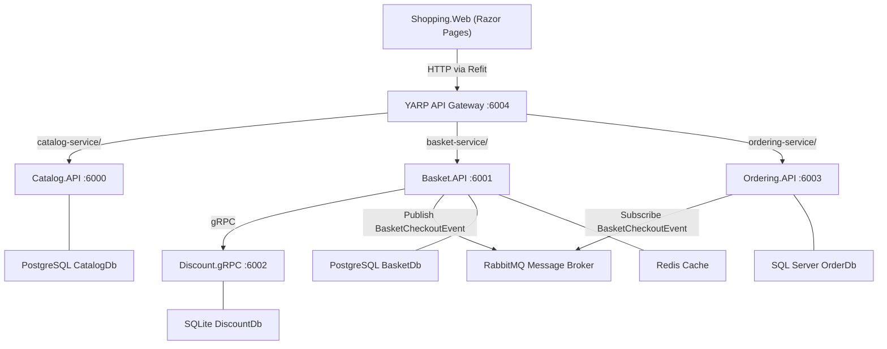
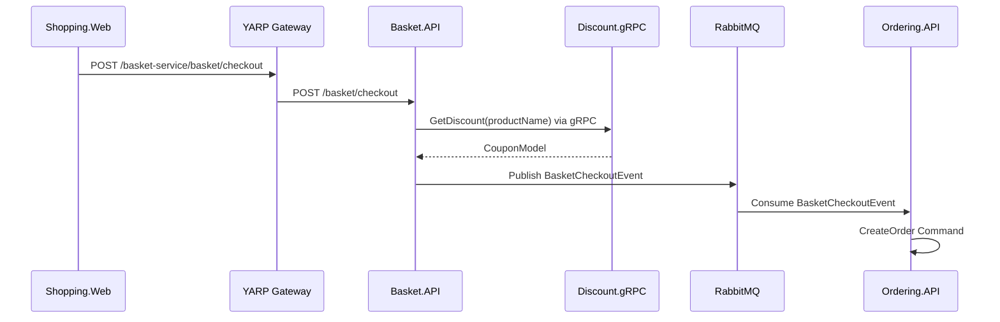

# 🛒 EShop Microservices — Proje Analizi

> **Oluşturulma Tarihi:** 2026-06-05  
> **Platform:** .NET 8, Docker, Microservices Architecture  
> **Çözüm Dosyası:** `eshop-microservices.sln`

---

## 📋 İçindekiler
1. [Genel Mimari](#genel-mimari)
2. [Proje Yapısı](#proje-yapısı)
3. [Servisler](#servisler)
   - [Catalog.API](#1-catalogapi)
   - [Basket.API](#2-basketapi)
   - [Discount.Grpc](#3-discountgrpc)
   - [Ordering (Clean Architecture)](#4-ordering-clean-architecture)
4. [BuildingBlocks (Ortak Kütüphaneler)](#buildingblocks-ortak-kütüphaneler)
5. [API Gateway](#api-gateway-yarpapigateway)
6. [Web Uygulaması](#web-uygulaması-shoppingweb)
7. [Altyapı and DevOps](#altyapı-ve-devops)
8. [Servisler Arası İletişim](#servisler-arası-iletisim)
9. [Kullanılan Teknolojiler and Paketler](#kullanılan-teknolojiler-ve-paketler)
10. [Port Haritası](#port-haritası)
11. [Geliştirme Önerileri](#geliştirme-önerileri)

---

## Genel Mimari



---

## Proje Yapısı

```
src/
├── eshop-microservices.sln
├── docker-compose.yml
├── docker-compose.override.yml
├── Services/
│   ├── Catalog/
│   │   └── Catalog.API/              # Ürün kataloğu servisi
│   ├── Basket/
│   │   └── Basket.API/               # Sepet yönetim servisi
│   ├── Discount/
│   │   └── Discount.Grpc/            # İndirim gRPC servisi
│   └── Ordering/
│       ├── Ordering.API/             # Sipariş API katmanı
│       ├── Ordering.Application/     # CQRS uygulama katmanı
│       ├── Ordering.Domain/          # Domain modeller & DDD
│       └── Ordering.Infrastructure/  # EF Core & veri erişimi
├── BuildingBlocks/
│   ├── BuildingBlocks/               # Ortak CQRS, Behaviors, Exceptions
│   └── BuildingBlocks.Messaging/     # MassTransit & RabbitMQ entegrasyonu
├── ApiGateways/
│   └── YarpApiGateway/               # YARP Reverse Proxy gateway
└── WebApps/
    └── Shopping.Web/                 # ASP.NET Core Razor Pages UI
```

---

## Servisler

### 1. Catalog.API

| Özellik | Detay |
|---------|-------|
| **Yol** | `Services/Catalog/Catalog.API` |
| **Port** | `6000` (HTTP), `6060` (HTTPS) |
| **Veritabanı** | PostgreSQL (`CatalogDb`) |
| **ORM** | Marten (PostgreSQL Document DB) |
| **Pattern** | Vertical Slice Architecture + CQRS |
| **Routing** | Carter (Minimal API) |

**CRUD İşlemleri (Vertical Slice):**
```
Products/
├── CreateProduct/         POST /products
├── GetProducts/           GET  /products
├── GetProductById/        GET  /products/{id}
├── GetProductByCategory/  GET  /products/category/{category}
├── UpdateProduct/         PUT  /products
└── DeleteProduct/         DELETE /products/{id}
```

**Domain Modeli:**
- `Product`: Id (Guid), Name, Category, Description, ImageFile, Price

**Önemli Detaylar:**
- Marten ile PostgreSQL'i döküman veritabanı gibi kullanır (NoSQL yaklaşımı)
- Development ortamında `CatalogInitialData` ile seed data yüklenir
- `ValidationBehavior<,>` ve `LoggingBehavior<,>` MediatR pipeline'a eklenmiştir
- PostgreSQL için Health Check endpoint: `/health`

---

### 2. Basket.API

| Özellik | Detay |
|---------|-------|
| **Yol** | `Services/Basket/Basket.API` |
| **Port** | `6001` (HTTP), `6061` (HTTPS) |
| **Veritabanı** | PostgreSQL (`BasketDb`) + Redis (Cache) |
| **ORM** | Marten |
| **Pattern** | Vertical Slice Architecture + CQRS + Decorator Pattern |
| **Routing** | Carter (Minimal API) |

**CRUD İşlemleri (Vertical Slice):**
```
Basket/
├── GetBasket/     GET    /basket/{userName}
├── StoreBasket/   POST   /basket
├── DeleteBasket/  DELETE /basket/{userName}
└── CheckoutBasket/ POST  /basket/checkout
```

**Önemli Detaylar:**
- `IBasketRepository` → `BasketRepository` (PostgreSQL/Marten)
- `Scrutor` kütüphanesi ile `CachedBasketRepository` Decorator olarak sarılır (Redis Cache)
- gRPC üzerinden **Discount.Grpc** servisini çağırır (ürün fiyatlarına indirim uygulamak için)
- Checkout sırasında **RabbitMQ**'ya `BasketCheckoutEvent` yayınlar
- Health Check: PostgreSQL + Redis

**Servis Bağımlılıkları:**
- Basket.API → Discount.Grpc (gRPC)
- Basket.API → RabbitMQ (MassTransit Publisher)
- Basket.API → BuildingBlocks
- Basket.API → BuildingBlocks.Messaging

---

### 3. Discount.Grpc

| Özellik | Detay |
|---------|-------|
| **Yol** | `Services/Discount/Discount.Grpc` |
| **Port** | `6002` (HTTP), `6062` (HTTPS) |
| **Veritabanı** | SQLite (`discountdb`) |
| **ORM** | Entity Framework Core (SQLite) |
| **Protokol** | gRPC (`discount.proto`) |

**Proto Tanımı:** `Protos/discount.proto`
- `GetDiscount(GetDiscountRequest)` → `CouponModel`

**Domain Modeli:**
- `Coupon`: Id, ProductName, Description, Amount

**Önemli Detaylar:**
- Sadece Basket.API tarafından tüketilir (dahili servis)
- Mapster ile DTO-Model dönüşümleri yapılır
- EF Core migration'ları mevcut; uygulama başlangıcında otomatik migrate edilir
- Dış dünyaya REST endpoint açmaz, yalnızca gRPC

---

### 4. Ordering (Clean Architecture)

Ordering servisi **4 katmanlı Clean Architecture** ile tasarlanmıştır:

```
Ordering/
├── Ordering.Domain         # DDD - Entities, Value Objects, Domain Events
├── Ordering.Application    # CQRS - Commands, Queries, Handlers, DTOs
├── Ordering.Infrastructure # EF Core - DbContext, Migrations, Repositories
└── Ordering.API            # Carter Endpoints, DI, Middleware
```

#### 4a. Ordering.Domain

| Özellik | Detay |
|---------|-------|
| **Pattern** | Domain-Driven Design (DDD) |
| **Bağımlılık** | Sadece .NET standart kütüphaneleri |

**Domain Modelleri:**
- `Order` → Aggregate Root (DDD)
  - `CustomerId`, `OrderName`, `ShippingAddress`, `BillingAddress`, `Payment`, `Status`, `OrderItems`
  - Factory method: `Order.Create(...)` → `OrderCreatedEvent` yayınlar
  - `Order.Update(...)` → `OrderUpdatedEvent` yayınlar
- `OrderItem` → Entity
- `Customer` → Entity
- `Product` → Entity

**Value Objects:**
```
ValueObjects/
├── Address.cs       # AddressLine, Country, State, ZipCode, EmailAddress
├── CustomerId.cs    # strongly-typed ID
├── OrderId.cs       # strongly-typed ID
├── OrderItemId.cs   # strongly-typed ID
├── OrderName.cs     # strongly-typed değer
├── Payment.cs       # CardName, CardNumber, Expiration, CVV, PaymentMethod
└── ProductId.cs     # strongly-typed ID
```

**Domain Abstractions:**
- `IEntity<T>`, `Entity<T>` → base entity
- `IAggregate<T>`, `Aggregate<T>` → domain event yönetimi
- `IDomainEvent` → MediatR INotification

#### 4b. Ordering.Application

| Özellik | Detay |
|---------|-------|
| **Pattern** | CQRS (MediatR) |
| **Bağımlılıklar** | BuildingBlocks, BuildingBlocks.Messaging, Ordering.Domain, EF Core |

**Commands:**
- `CreateOrderCommand` → `CreateOrderCommandHandler`
- `UpdateOrderCommand` → `UpdateOrderCommandHandler`
- `DeleteOrderCommand` → `DeleteOrderCommandHandler`

**Queries:**
- `GetOrdersQuery` → sayfalama ile tüm siparişler
- `GetOrdersByCustomerQuery` → müşteri ID ile siparişler
- `GetOrdersByNameQuery` → sipariş adı ile siparişler

**Event Handlers:**
- `BasketCheckoutEventHandler`: RabbitMQ'dan `BasketCheckoutEvent` alır → `CreateOrderCommand` tetikler

#### 4c. Ordering.Infrastructure

| Özellik | Detay |
|---------|-------|
| **Veritabanı** | SQL Server (`OrderDb`) |
| **ORM** | Entity Framework Core 8 |

**Özellikler:**
- `ApplicationDbContext` → EF Core DbContext
- Entity konfigürasyonları: `Configurations/` klasörü
- Audit interceptor: `AuditableEntityInterceptor` (CreatedAt/UpdatedAt otomatik)
- Development ortamında seed data ile veritabanı initialize edilir
- EF Core Migrations hazır

#### 4d. Ordering.API

| Özellik | Detay |
|---------|-------|
| **Port** | `6003` (HTTP), `6063` (HTTPS) |
| **Routing** | Carter (Minimal API) |

**Endpoint'ler:**
```
Endpoints/
├── CreateOrder.cs          POST   /orders
├── UpdateOrder.cs          PUT    /orders
├── DeleteOrder.cs          DELETE /orders/{id}
├── GetOrders.cs            GET    /orders
├── GetOrdersByCustomer.cs  GET    /orders/customer/{customerId}
└── GetOrdersByName.cs      GET    /orders/order/{orderName}
```

**Feature Flag:**
- `FeatureManagement__OrderFullfilment=false` (env. değişkeni ile kontrol)

---

## BuildingBlocks (Ortak Kütüphaneler)

### BuildingBlocks

> Tüm servisler tarafından kullanılan çapraz-kesim kaygıları (cross-cutting concerns)

**CQRS Soyutlamaları:**
```
CQRS/
├── ICommand.cs          # IRequest<TResponse> wrapper
├── ICommandHandler.cs   # IRequestHandler<TCommand, TResponse> wrapper
├── IQuery.cs            # IRequest<TResponse> wrapper
└── IQueryHandler.cs     # IRequestHandler<TQuery, TResponse> wrapper
```

**MediatR Pipeline Behaviors:**
```
Behaviors/
├── LoggingBehavior.cs      # Her request/response için loglama
└── ValidationBehavior.cs   # FluentValidation ile otomatik validation
```

**Kullanılan Paketler:**

| Paket | Versiyon |
|-------|----------|
| MediatR | 12.2.0 |
| FluentValidation | 11.9.0 |
| FluentValidation.AspNetCore | 11.3.0 |
| Mapster | 7.4.0 |
| Microsoft.FeatureManagement.AspNetCore | 3.2.0 |

---

### BuildingBlocks.Messaging

> Asenkron mesajlaşma altyapısı

**Integration Events:**
```
Events/
├── IntegrationEvent.cs        # Base: Id (Guid), CreationDate
└── BasketCheckoutEvent.cs     # Sepet checkout payload
```

**BasketCheckoutEvent alanları:**
- `UserName`, `CustomerId`, `TotalPrice`
- Shipping: `FirstName`, `LastName`, `EmailAddress`, `AddressLine`, `Country`, `State`, `ZipCode`
- Payment: `CardName`, `CardNumber`, `Expiration`, `CVV`, `PaymentMethod`

**Kullanılan Paket:**

| Paket | Versiyon |
|-------|----------|
| MassTransit.RabbitMQ | 8.1.3 |

---

## API Gateway (YarpApiGateway)

| Özellik | Detay |
|---------|-------|
| **Yol** | `ApiGateways/YarpApiGateway` |
| **Port** | `6004` (HTTP), `6064` (HTTPS) |
| **Teknoloji** | YARP (Yet Another Reverse Proxy) 2.1.0 |

**Route Yapılandırması:**

| Route | Path Pattern | Hedef | Rate Limit |
|-------|-------------|-------|------------|
| `catalog-route` | `/catalog-service/{**}` | `catalog.api:8080` | — |
| `basket-route` | `/basket-service/{**}` | `basket.api:8080` | — |
| `ordering-route` | `/ordering-service/{**}` | `ordering.api:8080` | `fixed` |

**Özellikler:**
- Ordering servisine `RateLimiterPolicy: "fixed"` uygulanmış
- Path transform ile prefix çıkarılır
- appsettings.json ve appsettings.Local.json ile konfigürasyon yönetimi

---

## Web Uygulaması (Shopping.Web)

| Özellik | Detay |
|---------|-------|
| **Yol** | `WebApps/Shopping.Web` |
| **Port** | `6005` (HTTP), `6065` (HTTPS) |
| **Teknoloji** | ASP.NET Core Razor Pages |
| **HTTP İstemci** | Refit 7.0.0 (strongly-typed HTTP client) |

**Refit Servisleri (Interface → YARP Gateway):**
- `ICatalogService` → `/catalog-service/...`
- `IBasketService` → `/basket-service/...`
- `IOrderingService` → `/ordering-service/...`

**Razor Sayfaları:**
```
Pages/
├── Index           # Ana sayfa
├── ProductList     # Ürün listesi
├── ProductDetail   # Ürün detayı
├── Cart            # Sepet görünümü
├── Checkout        # Ödeme/sipariş formu
├── Confirmation    # Sipariş onayı
├── OrderList       # Sipariş geçmişi
└── Contact         # İletişim sayfası
```

---

## Altyapı ve DevOps

### Docker Servisleri

| Servis | Image | Port | Açıklama |
|--------|-------|------|----------|
| `catalogdb` | postgres | 5432 | CatalogDb |
| `basketdb` | postgres | 5433 | BasketDb |
| `distributedcache` | redis | 6379 | Redis Cache |
| `orderdb` | mssql/server | 1433 | OrderDb |
| `messagebroker` | rabbitmq:management | 5672/15672 | RabbitMQ |
| `catalog.api` | catalogapi | 6000/6060 | Catalog |
| `basket.api` | basketapi | 6001/6061 | Basket |
| `discount.grpc` | discountgrpc | 6002/6062 | Discount |
| `ordering.api` | orderingapi | 6003/6063 | Ordering |
| `yarpapigateway` | yarpapigateway | 6004/6064 | API GW |
| `shopping.web` | shoppingweb | 6005/6065 | Web UI |

---

## Servisler Arası İletişim



---

## Kullanılan Teknolojiler ve Paketler

### Önemli NuGet Paketleri

| Paket | Amaç | Servis |
|-------|------|--------|
| Marten 6.4.1 | PostgreSQL Document Store | Catalog, Basket |
| Carter 8.0.0 | Minimal API endpoint routing | Catalog, Basket, Ordering |
| MediatR 12.2.0 | CQRS mediator | Tüm servisler |
| FluentValidation 11.9.0 | Model doğrulama | BuildingBlocks |
| Mapster 7.4.0 | Object mapping | Discount, BuildingBlocks |
| Grpc.AspNetCore 2.60.0 | gRPC server | Discount |
| Grpc.AspNetCore 2.49.0 | gRPC client | Basket |
| MassTransit.RabbitMQ 8.1.3 | Message broker | Basket, Ordering |
| Scrutor 4.2.2 | Decorator pattern DI | Basket |
| Yarp.ReverseProxy 2.1.0 | API Gateway | YarpApiGateway |
| Refit 7.0.0 | Typed HTTP client | Shopping.Web |
| FeatureManagement 3.2.0 | Feature flags | BuildingBlocks |
| EF Core 8.0.x | ORM | Discount, Ordering |

### Design Patterns

| Pattern | Nerede Kullanıldığı |
|---------|---------------------|
| Vertical Slice Architecture | Catalog.API, Basket.API |
| Clean Architecture | Ordering servisi (4 katman) |
| CQRS | Tüm servisler (MediatR) |
| Domain-Driven Design | Ordering.Domain |
| Decorator Pattern | Basket (CachedBasketRepository) |
| Repository Pattern | Basket.API |
| Aggregate Root | Ordering.Domain |
| Value Objects | Ordering.Domain |
| Domain Events | Ordering.Domain |
| Integration Events | BuildingBlocks.Messaging |
| Pipeline Behaviors | BuildingBlocks (Logging, Validation) |
| Feature Flags | Ordering (OrderFullfilment) |

---

## Port Haritası

| Servis | HTTP | HTTPS | Açıklama |
|--------|------|-------|----------|
| catalogdb | 5432 | — | PostgreSQL |
| basketdb | 5433 | — | PostgreSQL |
| distributedcache | 6379 | — | Redis |
| orderdb | 1433 | — | SQL Server |
| messagebroker | 5672 | — | RabbitMQ AMQP |
| messagebroker UI | 15672 | — | RabbitMQ Management |
| catalog.api | 6000 | 6060 | Catalog Servisi |
| basket.api | 6001 | 6061 | Basket Servisi |
| discount.grpc | 6002 | 6062 | Discount gRPC |
| ordering.api | 6003 | 6063 | Ordering Servisi |
| yarpapigateway | 6004 | 6064 | API Gateway |
| shopping.web | 6005 | 6065 | Web UI |

---

## Geliştirme Önerileri

### Güvenlik
- [ ] Identity Server / Keycloak entegrasyonu (JWT Authentication ve Authorization)
- [ ] API Gateway seviyesinde Authentication middleware
- [ ] Hassas config değerleri için Azure Key Vault

### Gözlemlenebilirlik (Observability)
- [ ] OpenTelemetry entegrasyonu (Distributed Tracing)
- [ ] Jaeger veya Zipkin ile trace görselleştirme
- [ ] Prometheus + Grafana ile metrik izleme
- [ ] Serilog + ELK Stack ile merkezi log yönetimi

### Test
- [ ] Her servis için Unit Test projesi
- [ ] Integration Test projeleri (WebApplicationFactory)
- [ ] Messaging Consumer ve Publisher testleri

### Yeni Özellikler
- [ ] **Identity/User Service**: Kullanıcı kayıt, giriş, profil yönetimi
- [ ] **Payment Service**: Ödeme işlemleri (Stripe, iyzico)
- [ ] **Notification Service**: Email/SMS bildirimleri
- [ ] **Search Service**: Elasticsearch ile gelişmiş ürün arama
- [ ] **Inventory/Stock Service**: Stok yönetimi

### Mimari İyileştirmeler
- [ ] **Outbox Pattern**: Güvenilir mesaj teslimi garantisi
- [ ] **Saga Pattern**: Distributed transaction yönetimi
- [ ] **API Versioning** eklenmesi
- [ ] **Circuit Breaker** (Polly) ile resilience
- [ ] Kubernetes deployment manifest'leri

---

## Hızlı Başlangıç

```bash
# Tüm servisleri Docker ile ayağa kaldır
docker-compose up -d

# Sadece altyapı servislerini başlat
docker-compose up -d catalogdb basketdb distributedcache orderdb messagebroker

# Durum kontrolü
docker-compose ps

# Log görüntüleme
docker-compose logs -f catalog.api
```

**Health Check Endpoint'leri:**
- Catalog: http://localhost:6000/health
- Basket: http://localhost:6001/health
- Ordering: http://localhost:6003/health

**RabbitMQ Yönetim Paneli:** http://localhost:15672 (guest/guest)

---

*Bu doküman, `eshop-microservices` projesinin tüm bileşenlerini kapsayan canlı bir referans belgesidir.*
